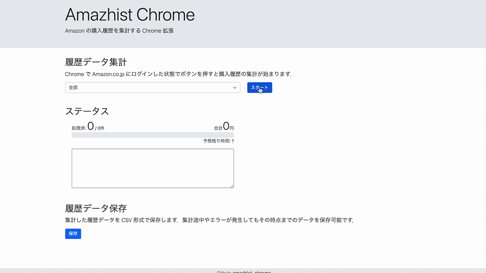
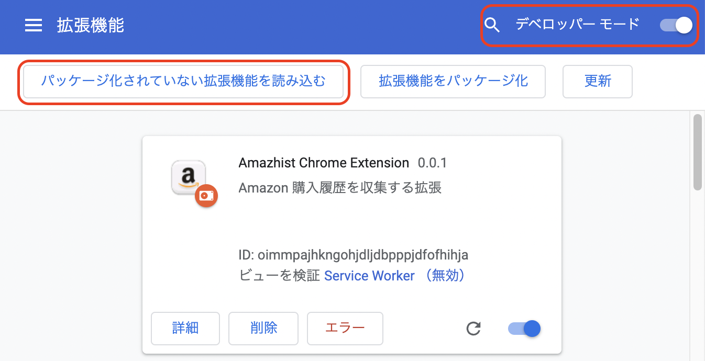

# amazhist_chrome

amazhist_chrome は，Amazon の買い物履歴情報を集計する Chrome 拡張です．
集計したデータは CSV で書き出せるので Excel での加工も用意です．

## インストール

2通りのインストール方法があります．Chrome ウェブストアからのインストールがお手軽です．

### Chrome ウェブストアから

下記のページの「Chromeに追加」ボタンをクリックするとインストールできます．

[Amazhist Chrome Extension](https://chrome.google.com/webstore/detail/amazhist-chrome-extension/mfejdgdpblipdoileogibknihogejaja?hl=ja)

### Github から

1. Github からソース一式をダウンロード．

2. Chrome の「拡張機能」タブでディベロッパーモードを有効化．

3. 「パッケージ化されていない拡張機能を読み込む」で，amazhist_chrom の **src ディレクトリ** を指定．

## 使い方

1. アドレスバーの右側にある Amazhist Chrome Extension のアイコンをクリックします．(拡張機能が沢山ある場合は，アドレスバーの右側のジグゾーパズルのようなアイコンをクリックすると，現れると思います)

2. 「スタート」ボタンをクリックすると，データの集計が始まります．

3. 「保存」ボタンをクリックすると，集計したデータを CSV 形式に保存できます．

## TODO

- レジューム機能の追加．
  現時点だと，何らかの理由で動作が一旦停止すると途中から再開できません．
