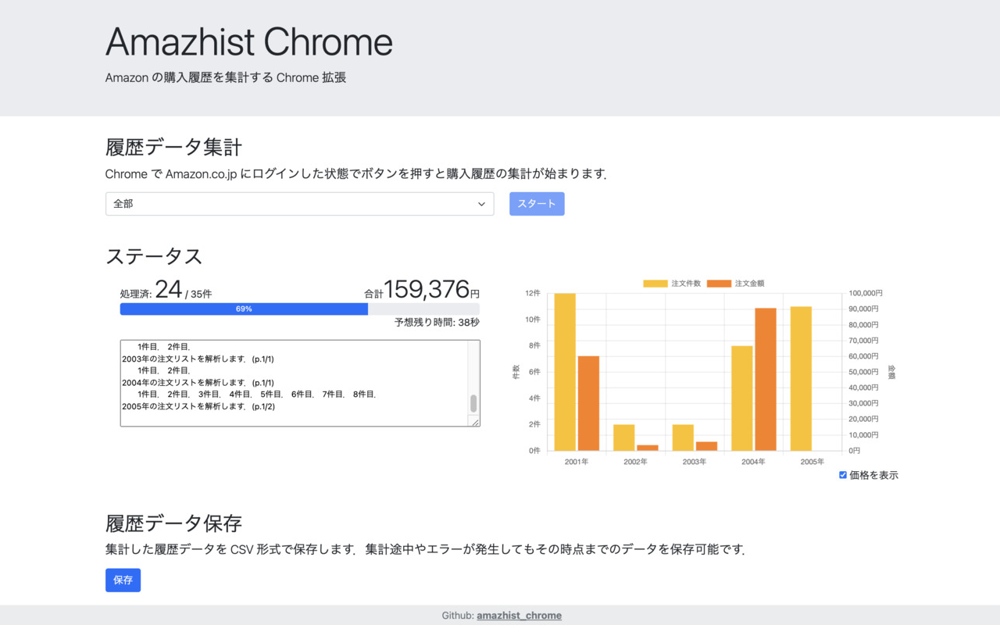

# amazhist_chrome

amazhist_chrome は，Amazon の買い物履歴情報を取得する Chrome 拡張です．

## インストール

1. Chrome の「拡張機能」タブでディベロッパーモードを有効化．()

2. 「パッケージ化されていない拡張機能を読み込む」で，amazhist_chrom の src ディレクトリを指定．

## 使い方

1. アドレスバーの右側にある Amazhist Chrome Extension のアイコンをクリックします．(拡張機能が沢山ある場合は，アドレスバーの右側のジグゾーパズルのようなアイコンをクリックすると，現れると思います)

2. 「スタート」ボタンをクリックすると，データの収集が始まります．

3. 「保存」ボタンをクリックすると，収集したデータを JSON 形式に保存できます．

## 備考

Chrome 拡張の制約なのか，他のタブで Web 閲覧を行うと動作が停止してしまうようです．
